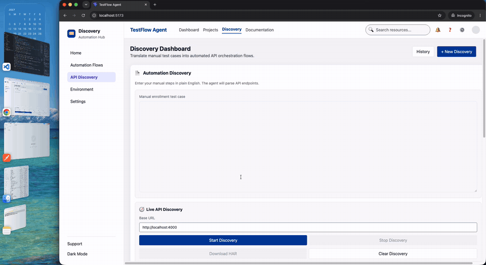
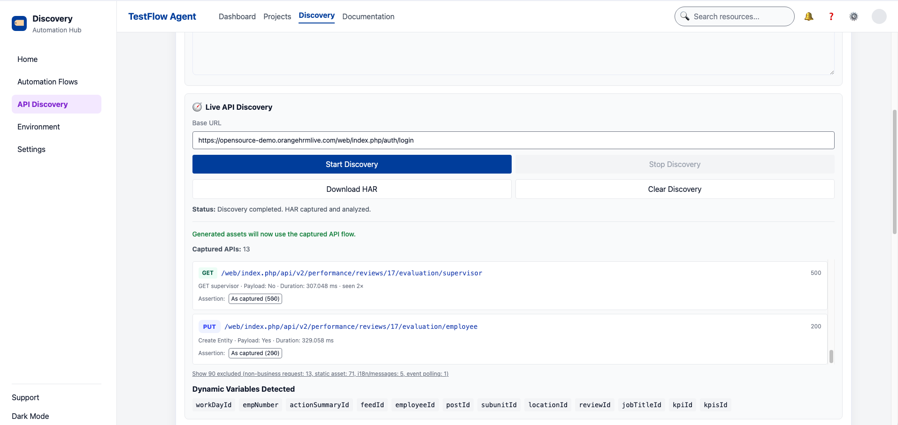
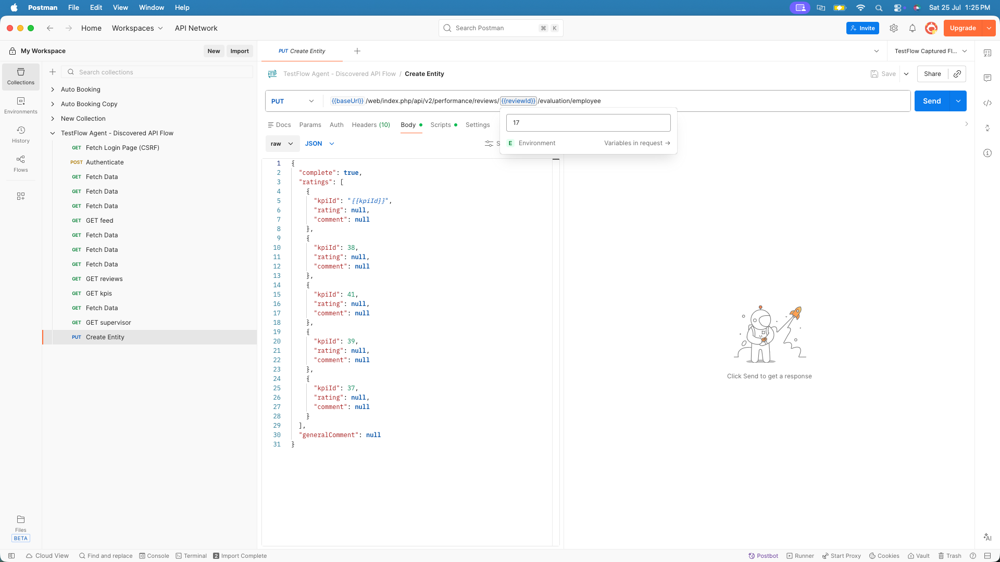

# TestFlow Agent

**Turn plain-English test cases — or real recorded browser traffic — into runnable API automation assets in under a minute.**

TestFlow Agent is an automation-discovery assistant for QA engineers. It reads a business flow (either described in natural language or captured live from a real application) and generates a complete, immediately-runnable automation workspace: a **Postman collection + environment**, a **Playwright API test**, and a **JMeter `.jmx` load plan** — all sharing the same correlated variables, assertions, and session handling.

<p align="left">
  
  
  
  
  
</p>



<sub><i>End to end: describe a flow (or record a real app), then generate a correlated Postman collection, Playwright spec, and JMeter plan — and run it.</i></sub>

---

## Table of Contents

- [Why this project exists](#why-this-project-exists)
- [Two ways to generate a flow](#two-ways-to-generate-a-flow)
- [Engineering highlights](#engineering-highlights)
- [Generated artifacts](#generated-artifacts)
- [Architecture](#architecture)
- [Tech stack](#tech-stack)
- [Quick start](#quick-start)
- [Worked example](#worked-example)
- [Productivity impact](#productivity-impact)
- [Roadmap](#roadmap)

---

## Why this project exists

Building API automation by hand is slow and repetitive. For a single business flow — say, creating an enrollment — a tester typically has to:

1. Log in and mint an access token
2. Create prerequisite data (a member)
3. Fetch and select dependent resources (eligible plans)
4. Submit the transaction with the right payload
5. Validate the result
6. **Correlate dynamic values** (tokens, IDs) across every step
7. Rebuild all of the above three times — once each for Postman, Playwright, and JMeter

The correlation and rebuild work is where hours disappear, and it has to be redone for every new flow and every tool. TestFlow Agent collapses that into a single describe-or-record step and emits all three toolchains at once, kept in lockstep.

---

## Two ways to generate a flow

TestFlow Agent supports two input modes that feed the **same** generation engine, so the four output formats always represent one coherent business flow.

### 1. Manual scenario — describe it in English

Type the scenario in plain language:

```text
Create an enrollment for a Texas member.
Get available plans for Texas. Select a Silver plan.
Submit enrollment with effective date 01/01/2026.
Validate enrollment status is ACTIVE and enrollment ID is generated.
```

The agent parses intent — **state, plan tier, effective date, and positive-vs-negative validation** — and derives the API orchestration:

```http
POST {{baseUrl}}/auth/token
POST {{baseUrl}}/members
GET  {{baseUrl}}/plans?state=TX
POST {{baseUrl}}/enrollments
GET  {{baseUrl}}/enrollments/{{enrollmentId}}
```

Positive and negative paths diverge exactly where they should: the "missing effective date" negative case drops `effectiveDate`, asserts **HTTP 400**, and skips the validation call — instead of pretending a broken request succeeded.

The generated flow can also be **executed live** against a bundled mock API, so the output is provably runnable, not just static text.

### 2. Live discovery — record a real application

Point the agent at any web app, drive the flow by hand in a launched browser, and it reverse-engineers runnable automation from the captured traffic:

- Enter a base URL → **Start Discovery** launches headed Chromium via Playwright and records a HAR
- Perform the real flow manually (log in, navigate, submit)
- **Stop Discovery** classifies, sanitizes, and correlates the captured requests into business-relevant API calls and dynamic variables — then generates all four artifacts from *that*

This path has been verified end-to-end against a live [OrangeHRM](https://opensource-demo.orangehrmlive.com) instance, including a working login-with-CSRF replay.



<sub><i>Live discovery of a real OrangeHRM session: 13 business API calls captured, 90 noise requests auto-excluded (static assets, i18n, tracking), and dynamic identifiers (`empNumber`, `reviewId`, `jobTitleId`, `kpiId`…) correlated automatically — ready to generate from.</i></sub>

---

## Engineering highlights

The interesting engineering lives in the **live discovery engine** — turning noisy real-world browser traffic into artifacts that actually run on a rerun. A few of the harder problems solved:

**Intelligent dynamic-variable detection.** Rather than a fixed allow-list, fields are promoted to variables by a mix of known identity keys (`accessToken`, `memberId`, `enrollmentId`, …) and a generic `Id`/`Number` pattern. When a bare `id` is found, its name is derived from the **immediate JSON parent key** (`employee.id` → `employeeId`, `leaveType.id` → `leaveTypeId`) — deliberately *not* from the URL path, because on real apps almost every endpoint contains words like "employees" regardless of what a given `id` identifies.

**Reuse scoring to disambiguate collisions.** When two entities share a field name (e.g. the logged-in admin's `empNumber` vs. the *target* employee's), the engine picks the value with the highest **reuse score** — a match that reappears as a URL path segment or exact query value outranks one that merely coincides inside an unrelated JSON blob. IDs returned by mutating (`POST`/`PUT`/`DELETE`) steps are always eligible, so a just-created resource's own ID isn't crowded out by an earlier list read.

**Whole-token-safe substitution.** Short numeric IDs are matched and templated only on whole-token boundaries — a reused id of `7` must never corrupt a port number like `4700`. This safety lives in one shared module (`backend/lib/sanitize.js`) used by both capture and generation, so the rule can't drift between the two.

**CSRF refresh, not snapshot replay.** Session-bound tokens are stale by the next run. Instead of replaying a dead token, the engine looks backward from the login step for the nearest HTML page that embedded a token, and every generator prepends a **"Fetch Login Page (CSRF)"** step that re-extracts a *fresh* token at runtime — so the collection/spec/plan can actually log in on a rerun.

**Runnable-by-default, masked-only-on-display.** The internal session keeps real captured values (including credentials) so generated artifacts run without manual fill-in; masking is applied **only** to what the UI displays. The split is deliberate — moving masking into the capture path would silently break the runnability that is the whole point of the feature.

**Toolchain-correct session handling.** Postman and Playwright carry cookies automatically; JMeter doesn't — so the generated `.jmx` injects an `HTTPCookieManager` on the thread group, without which every step after login would 401. Details like this are why the three outputs are truly interchangeable rather than superficially similar.

**Noise reduction.** Static assets, analytics/tracking, i18n, and push-event traffic are excluded; identical repeated requests are de-duplicated (with a `repeatCount`) before generation, while the raw captured list stays available for audit.

---

## Generated artifacts

Every run emits a coordinated set of stable-named files that import/run directly in their respective tools:

| Tool | Manual scenario | Live discovery |
|------|-----------------|----------------|
| **Postman** collection | `testflow-enrollment-collection.json` | `discovered-flow-collection.json` |
| **Postman** environment | `testflow-enrollment-environment.json` | `discovered-flow-environment.json` |
| **Playwright** API spec | `enrollment-flow.spec.ts` | `discovered-flow.spec.ts` |
| **JMeter** test plan | `enrollment-flow.jmx` | `discovered-flow.jmx` |
| **Data reference** | — | `discovered-flow-data.json` |

All formats share one variable vocabulary (`baseUrl`, `accessToken`, `memberId`, `planId`, `enrollmentId`, `state`, `effectiveDate`) and the same assertions, so switching tools never means re-deriving the flow.



<sub><i>The generated collection imported into Postman — named steps (including the auto-added <b>Fetch Login Page (CSRF)</b>), identifiers already templated as <code>{{reviewId}}</code>/<code>{{kpiId}}</code> and resolved from the generated environment. No manual fill-in — import and run.</i></sub>

---

## Architecture

Three independent local services, no shared build — the backend is the core.

```text
testflow-agent/
├── frontend/            React 19 + Vite dashboard (scenario input, live discovery
│                        panel, generated assets, execution results)
├── backend/             Express API — the generation engine
│   ├── server.js                    thin: mounts /agent and /discovery
│   ├── routes/                      analysisRoutes.js · discoveryRoutes.js
│   ├── lib/
│   │   ├── analysisHelpers.js       scenario parsing + all four generators
│   │   └── sanitize.js              shared masking + safe-substitution logic
│   └── services/
│       └── discoveryService.js      headed-browser capture → classify → correlate
└── mock-enrollment-api/ In-memory Express API for a runnable enrollment demo
                         (/auth/token → /members → /plans → /enrollments)
```

```text
                 ┌─────────────────────────┐
  Plain English ─▶│  parseScenario()        │─┐
                 └─────────────────────────┘ │   ┌──────────────────────────┐
                                             ├──▶│  Unified generators       │──▶ Postman
                 ┌─────────────────────────┐ │   │  (Postman/Playwright/     │──▶ Playwright
  Live browser ─▶│  discoveryService       │─┘   │   JMeter/live-run)        │──▶ JMeter
   (HAR capture) │  classify · correlate    │    └──────────────────────────┘──▶ Live execution
                 └─────────────────────────┘
```

Both input paths normalize into the same internal shape, then fan out through one set of generators — which is why the four outputs never drift apart.

---

## Tech stack

| Layer | Technology |
|-------|-----------|
| Frontend | React 19, Vite 8, Axios |
| Backend | Node.js, Express 4 |
| Browser capture & codegen | Playwright (headed Chromium, HAR) |
| Output formats | Postman Collection v2.1, Playwright Test, Apache JMeter `.jmx` |
| Demo target | In-memory mock enrollment API |

---

## Quick start

### Option A — Docker (one command)

```bash
docker compose up --build
```

Then open **http://localhost:5173**. This boots all three services and is the fastest way to try the manual-scenario path (analyze → generate Postman/Playwright/JMeter → run enrollment flow).

> **Live discovery** launches a *headed* browser to record real traffic, so it's best run natively (Option B) rather than in a container.

### Option B — Native (needed for live discovery)

Run the three services, each in its own terminal:

```bash
# 1. Mock enrollment API  → http://localhost:4000
node mock-enrollment-api/server.js

# 2. Backend agent API    → http://localhost:5001
node backend/server.js            # or: npm --prefix backend run dev

# 3. Frontend dashboard   → http://localhost:5173
npm --prefix frontend run dev
```

Then open **http://localhost:5173**, enter a scenario (or start a live discovery session), and generate.

> Live discovery additionally requires Playwright's Chromium — install once with `npx playwright install chromium`.

---

## Worked example

**Manual scenario → live execution.** Enter the Texas Silver scenario, click **Analyze Flow**, review the detected API sequence, then generate Postman / Playwright / JMeter and click **Run Enrollment Flow**. The dashboard reports the live result:

```text
Enrollment Created and Validated Successfully
Enrollment ID · Member ID · Plan ID · Status: ACTIVE · Execution Time
```

**Live discovery → OrangeHRM.** Point discovery at `https://opensource-demo.orangehrmlive.com`, log in and browse in the launched browser, then stop. The agent captures the login (with CSRF), classifies the business API calls, correlates identifiers like `empNumber` and `jobTitleId`, and emits a Postman/Playwright/JMeter set that logs in and replays the flow against the live server.

---

## Productivity impact

Hand-building the same coverage, per the tables above:

| Artifact | Typical manual effort |
|----------|----------------------|
| Postman collection with variables + validations | 45–60 min |
| Playwright chained API test | 60–90 min |
| JMeter plan with headers, extractors, assertions, correlation | 2–3 hrs |
| **TestFlow Agent (all three, correlated)** | **< 1 min** |

Beyond raw speed, the real gain is **consistency**: one described-or-recorded flow becomes three toolchains that agree on variables, assertions, and session handling — no per-tool drift, no re-correlation.

---

## Roadmap

- HAR upload/import (in addition to live capture)
- Swagger / OpenAPI ingestion
- Real JMeter execution with report generation
- Rule- or AI-based test-data generation
- CI/CD pipeline scaffolding for generated suites
- Broader domain coverage beyond enrollment

---

## Author

**Shankar Subramanian** — QA & Test Automation Engineer

- GitHub: [@sshankar07](https://github.com/sshankar07)
- Email: [shankar.qa14@gmail.com](mailto:shankar.qa14@gmail.com)

Designed and built end to end: the scenario-parsing and generation engine, the live browser-capture discovery pipeline (dynamic-variable correlation, CSRF refresh, toolchain-correct session handling), and the React dashboard.

---

## License

Released under the [MIT License](LICENSE) — © 2026 Shankar Subramanian.

---

<sub>TestFlow Agent began as a reasoning-agent concept — understand business intent, map it to API orchestration, correlate dynamic state, and emit executable assets — and grew into a working discovery-and-automation tool validated against a live production-style application.</sub>
